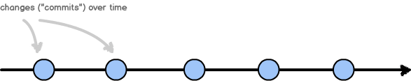
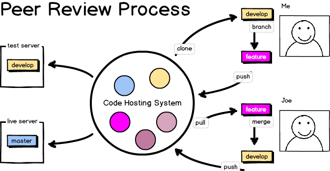

## Warning!

This is not a talk about Git commands. Need help with that? Go here:

- http://drupalize.me/series/introduction-git-series
- http://git-scm.com/doc
- http://try.github.io
- http://help.github.com

## To Solve a Problem,  We Must First Accurately Describe It

Note: someone recently told me that dyslexia was, fundamentally, the ability to
see 2D objects in three dimensions. Ages ago, someone else told me that
stuttering was actually a delay in hearing.

## Things seem hard  when they defy description.

## Everything you do will affect the commands you issue to your version control system.

Note: captain obvious statement

## How you grant access to the code affects your workflow.

Note: **Centralized:** everyone works in master from the same disk.
**Branching** how we work. Anyone can check into master. **Forking** how
Canonical works. The testbot gets final approval into master. Typical for open
source projects.

## The way you need to 'snapshot' your code affects your workflow.

## Workflow =  Actions + Locations + Permissions

Note: this is where we want to end up by the end of today. You know where each
branch lives. You know how / where a branch is closed.

## Workflow Solves Hard Problems with Trivial Questions

- What are you doing?
- Where are you doing it?
- How do you move your work from one location to another?

## Workflow Commandment: Assumptions are Written Down.

Note: Naming is really important. It allows us to create arbitrary rules of
engagement and ensures that we are all using the same "playbook". Which is some
kind of sports ball thing.

## Terms and Conditions

(boring, I know)

## Developer Workflow
A team of people using an agreed upon set of arbitrary rules and specific tools
to update and share their code.

## The Stages of a Work

- Idea
- Ticket
- Agreement / sign-off
- Code
- Approval
- Pending
- Deployed

Note: this is how we go from idea to deployed code. Your stages may vary
slightly, but I wanted you to be able to see my assumptions.

## Possible Actions When Working with Code

- **Generate:** Writing and commit the code to storage
- **Approve:** Receive, review, and obtain stakeholder approval
- **Deploy:** Share or publish the code

There are three things here. Remember them!

Note: This is important, because our git command will correspond to these three
basic concepts. A stakeholder can also be an automated bot.

## &lt;/boring>

==========

## Workflow Commandment:  Actions are performed in isolation.

Note: We do not store code in the same place as we deploy code. We do not
generate and approve code in the same place.

## Separating Actions

- By location.
- By "state".

Note: state is what I mean, but it has some grammatical difficulties.
Suggestions welcome for this term.

## Locations Are Determined by Actions

- Code hosting
- Local developer environment
- Automated testing
- Client approval
- QA
- Staging
- Production

Note: remember that actions must be isolated. So each time you need to apply a
different action, you also need to change the location.

==========
## Workflow Commandment: Only Tested Code is Deployed

Note: Our goal is to deploy only code which has been tested. In order to test
each change, we must be able to alter our personal workspaces to reflect a set
of defined changes.

## Permission Strategies

- Centralized Workflow
- Patch Workflow
- Forking Workflow
- Feature Branch Workflow

## Permission Strategy: Patch Workflow

Everyone has read access. Very few have write access. Suggested changes are
presented through a patch file.

- Forces a review process.
- Patches need to be rerolled to stay up-to-date.
- e.g. Drupal

## Permission Strategy: Forking Workflow

Project forks give full permissions to developers so they can do work.
New work is added through a request to upstream project.

- Forces a review process.
- "Modern" way of doing a Patch Workflow.
- e.g. FOSS project on GitHub

## Permission Strategy: Feature Branch Workflow

- Ensures clean/working master (good for CI)
- Encourages code review (does not force)
- Encourages experimentation (cheap to branch)
- Reduces overhead of forking workflow
- e.g. your internal project (probably)

==========
## People
- Who are the people on your team?
- Ideally, how would they work together? (You might not know the answer yet.)

## Branching Strategies for Your Workflow

## Branching Strategies

- How (and where) you merge changes into trunk.
- How you open and close tickets.

## Branching Strategies: Gitflow

- about as complicated as you can get, trying to bring order to chaos
- good for software with releases
- pro: easy to always find the “stable” production ready code
- con: complex, often times overkill

==========

## Permissions + Branching = Workflow

## Our Worklow

- [Star Wars Sprintflow](../../resources/workflow-sample-starwars.md)
- [Whispering Pines Weekly Workflow](../../resources/workflow-sample-whisperingpines-code.md)

Note: these are both in the resources for the repository

## Your Workflow

- Make your own, mix & match.
- Assign it a name, so that you can change the workflow.
- Whatever you do make sure your team agrees on it and that it gets documented.

## States

- Branch
- Commit hash
- Tag (a tag is just an easy way to remember a commit hash)

==========

## Workflow Commandment: Anything which is arbitrary must have a convention.

## Naming is Done by Convention

- Branches: When and what do you branch from/into?
- Branches: How do you create / finish a branch?
- Tags: What is the naming convention for tags?

## Approval Process Follow Conventions Too

- Who are your stakeholders and where do they get approval? This will determine how you start/finish a branch.

Sample stakeholders:

- External stakeholder ("the client")
- Peer review
- Automated tests
- Manager review

## Up for Debate: How Do You Revert Bad Changes?

1. Roll "forward" to an old commit.
1. Flip Apache back to an old copy of the already deployed code (assumes no DB changes).

## Document your Workflow

- Include necessary commands.
- Include all steps e.g.
    - Code review
    - Mark ticket as closed

## Summary of Workflow Commandments

1. Assumptions are written down.
1. Actions are performed in isolation to one another.
1. Only tested code is deployed.
1. Anything that is arbitrary must follow a convention.
1. Stakeholder access determine levels of branching.

Note: Workflow Commandment: Faster is better. Inconsistency leads to mistakes.

==========

## Extras

Skip me. :)

## Activity

- Add branching strategy details to your workflow diagram.
- Identify roles on your team
- Add arrows to indicate the flow of code
- Add name of the branch

## Ticketing Systems

- Tell us your current challenges.

