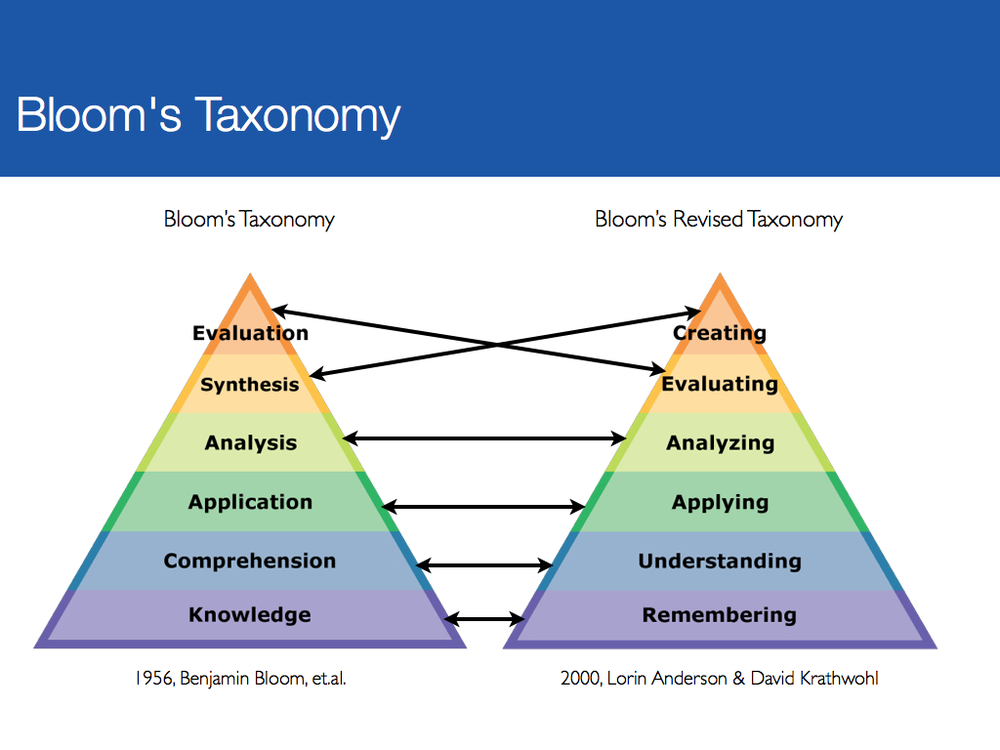
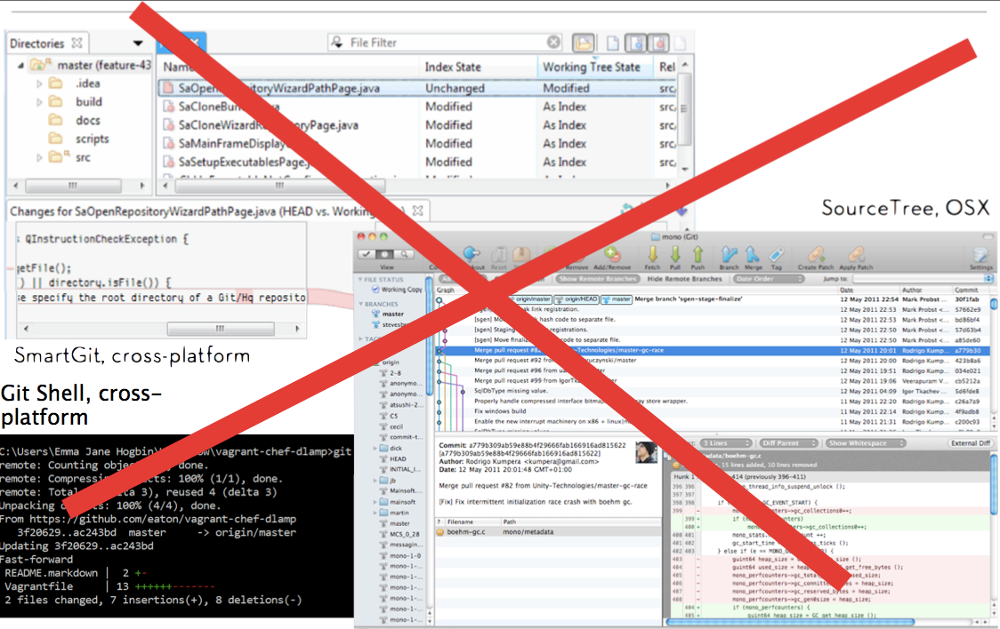
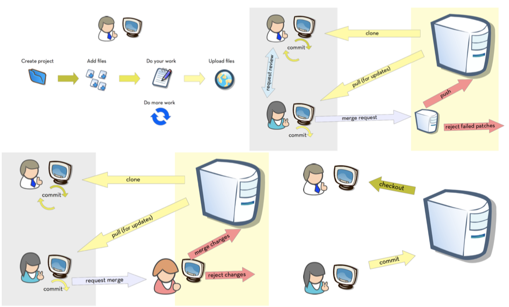
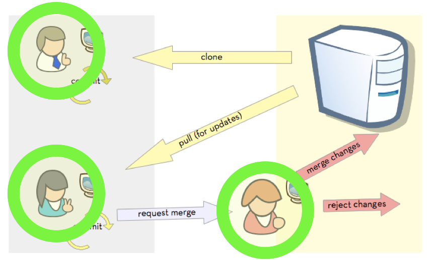
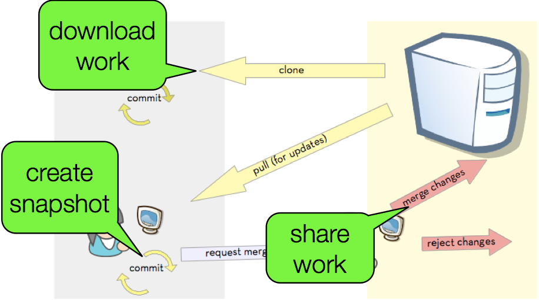
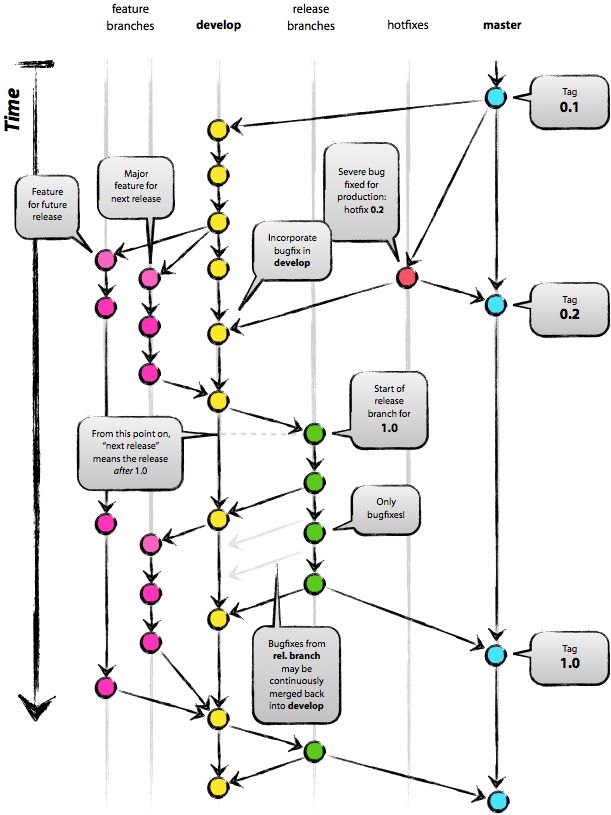
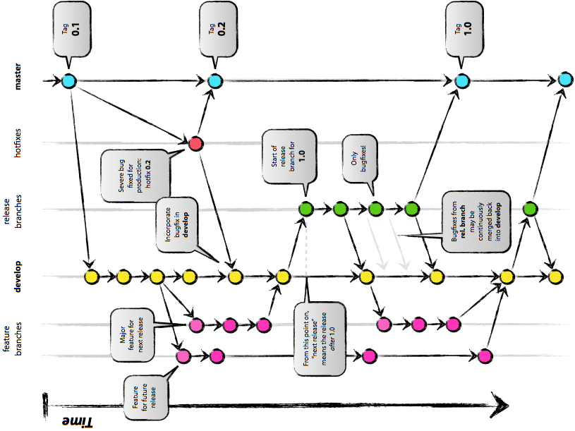

## Warning!

This is not a talk about all the commands you can run in Git.

### Resources for Commands:

- [Introduction to Git](http://drupalize.me/series/introduction-git-series) video lessons
- [Git Documentation](http://git-scm.com/doc)
- [Pro Git](http://git-scm.com/book)
- [ungit](https://github.com/FredrikNoren/ungit) web UI / visualization tool

## "I've tried! I can't learn this stuff."

~ most people in this room

Note: It’s not your fault. Honest. The way we teach web stuff isn’t the way that you probably need to be exposed to the information in order to learn it. Blame the teachers, not yourself. Or maybe not blame but, be persistent when working to solve important and sticky problems.

## "I am a Git rockstar."

~ some people in this room

## Git was built for (and by) Linux kernel developers.

Note: Quick show of hands: How many people will raise their hand when asked? Great. And how many people here are Linux kernel developers?

## How we typically teach people "how to tech" has nothing to do with adult education best practices.

Note: RTFM: read the manual. Here are all the commands, here are all the options. Memorize everything, and figure out later how to apply the knowledge.

## Adults learn best when they can be selfish.

Note: Andragogy assumes the following about the design of learning: Adults have the need to know why they are learning something. Adults learn through doing. Adults are problem-solvers. Adults learn best when the subject is of immediate use.

## "Please memorize all Git commands and use only rebasing when merging your work."

~ No client ever.

Note: Your problem might sound like: My client keeps changing his mind, and but they don’t want to pay me to redo the work. Your problem doesn’t sound like: My client wants me to memorize all the parameters for using Git at the command line.

## Start with the whole to solve real problems.

Note: Define your real problem clearly. Learn how to use a tool to get your problem solved. Try solving the problem. Take notes about how smooth it was to solve your problem. Write recommendations to your future self on how you’d solve the problem in the future now that you know what you know.

## 

[Source: education ambassador](http://educationambassador.com/resources/entry/android-apps-for-blooms-remembering)

Note: Remember: recall the information. memorize, define, duplicate. Understand/Explain: Explain ideas or concepts. Recognize, paraphrase, describe. Apply: Use the information in a new way. Illustrate, demonstrate. Analyze: distinguish between different parts. Compare, contrast, experiment, question, test. Evaluate: justify a stand or a decision. Judge, defend, argue. Create: Create new product or POV. Assemble, construct, design.

## Agenda

- Sample team workflow
- Branch management strategies
- Q&A / therapy session

## 

## Your problems are (mostly) social.

## 

Note: Any workflow you can imagine, Git can probably handle.

## 

Note: Which is just a fun way of saying, "Git don't care!"

## 

Note: If you're working on a very large teams, think in terms of roles, instead of individual people if it's easier.

## 

Note: once you've identified people on your team, write down the tasks they need to accomplish.

## Who's on your code team?

- developers
- designers
- project managers
- clients

Note: Write down a list of all of the people on your code team. This list may include:

## What tasks do you work on?

- Writing code.
- Reviewing code.
- Pushing tested code to the server.
- Fixing broken code.

Note: Maybe you do everything. Maybe you only do some things. Write a list of all the tasks you are actually responsible for.

## What are your tools and constraints?

- Version control software (we’ll always assume Git)
- Code hosting system (Bitbucket, GitHub, self-hosted)
- Server ecosystem (dev / staging / live)
- Code editors & integrated developer environments (vim, Dreamweaver, Sublime, PHPstorm)
- Automated testing systems or review “gates”

Note: Often there are other things we need to fit into our workflow. Create a third list of any tools and restraints you are aware of.

## What's your workflow?

- Scheduled Release: [Gitflow](http://nvie.com/posts/a-successful-git-branching-model/) 
  or [Simplified Gitflow](http://drewfradette.ca/a-simpler-successful-git-branching-model/)
- Continuous Deployment: [Branch Per Feature](https://www.acquia.com/blog/pragmatic-guide-branch-feature-git-branching-strategy)
  or [GitHub Flow](http://scottchacon.com/2011/08/31/github-flow.html)

Note: With the team members identified, it’s time to sketch out how these people (ideally) work together.

## Interpreting Workflows

Note: completed diagrams can be really hard to tease apart. Rebuild the diagrams to make them your own.

## 

## "Continuous Deployment"

Note: Code is deployed faster than scheduled releases. Requires (trusted) test coverage. Typically uses a mechanical gatekeeper to check in code to the master branch. Fewer branches to maintain / keep updated.

## The Star Wars Workflow

Note: pre-launch: peer review with branched permission strategy; separate QA server where work is available for review, but typically devs just look at their local version of the current dev branch.

## Scheduled Release

Note: Incorporates human-reviews, and possibly automated tests. Allows you to collate many smaller changes into a single release.

## Whispering Pines Workflow

Note: Aiming for stability first, speed second. Some test coverage. Changes are collated weekly onto a QA server, and deployed from there.

## Sketch out your workflow

- Identify the roles on your team.
- Identify the relationships between the team members.
- Draw arrows to show how code flows between team members.
- Map the Git commands onto the arrows.

## Sample Workflow

Note: this is the star wars sprintflow. There are more layers for the WP workflow.

==========
## Resources

- github.com/emmajane/gitforteams
- [Workflow for Developers](http://developerworkflow.com)
- [Managing Chaos: Digital Governance by Design](http://www.rosenfeldmedia.com/books/web-governance/)
- [Workflows and Permissions Strategies](https://www.atlassian.com/git/workflows)
- Scheduled Release: [Gitflow](http://nvie.com/posts/a-successful-git-branching-model/)
  ([Cheatsheet](http://danielkummer.github.io/git-flow-cheatsheet/))
  or [Simplified Gitflow](http://drewfradette.ca/a-simpler-successful-git-branching-model/)
- Continuous Deployment: [Branch Per Feature](https://www.acquia.com/blog/pragmatic-guide-branch-feature-git-branching-strategy)
  or [GitHub Flow](http://scottchacon.com/2011/08/31/github-flow.html)